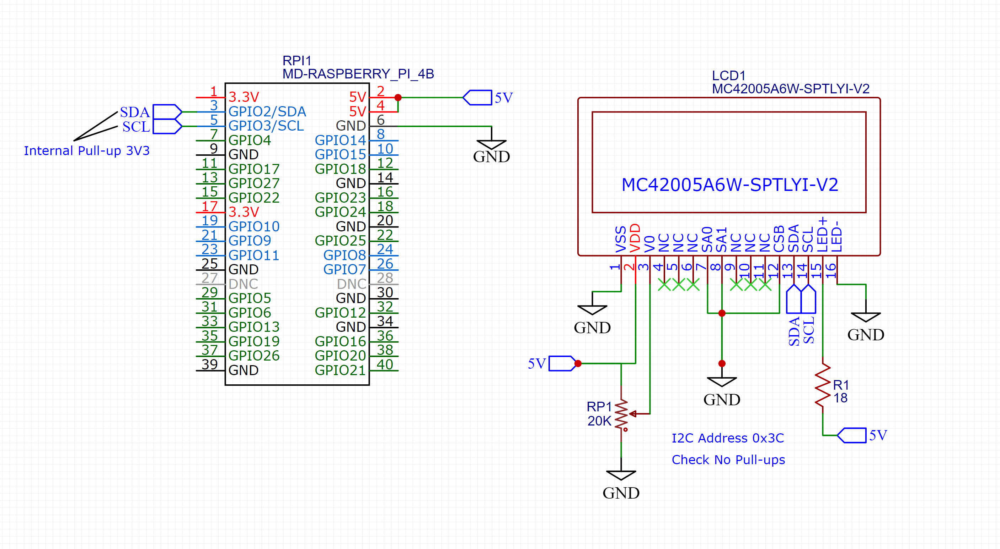

# About the lcdrw1063 library

This lcdrw1063 lightweiht library provides a Python RW1063 LCD I2C driver to be used with the Raspberry PI.

It gives functions to quickly control what is displayed and how.

Supports only i2c bus communications and 8-bit write commands.

# Dependencies

smbus2: A drop-in replacement for smbus-cffi/smbus-python in pure Python
<code bash>
pip install smbus2
</code>

# Public methods

TODO

# Usage

TODO

# Wiring Diagram

# TODO

* Add digital port for controlling the Chip Select (CS) state from the library.
* Add a digital port to turn the LCD backlight on/off.
* Add configuration of number of columns and rows.
* Property for setting cursor at specific row and column position. cursor_pos = (0, 5)
* Encapsulate private methods.
