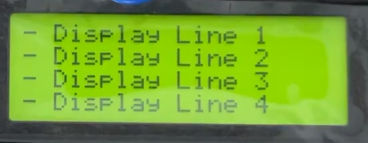
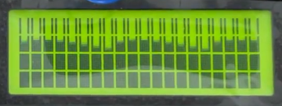

# About the lcdrw1063 library

The **lcdrw1063** lightweight library provides a Python RW1063 LCD I2C driver for use with the Raspberry Pi. It simplifies controlling display content and appearance.

Key features include:
- Easy-to-use functions for display manipulation.
- Compatible solely with i2c bus communication and 8-bit write commands.

Tested with the MC42005A6W-SPTLYI-V2 20 columns x 4 rows, 5mm character height transflective LCD display module from MIDAS Displays.

---

# Dependencies

smbus2: A drop-in replacement for smbus-cffi/smbus-python in pure Python

```bash
pip install smbus2
```
---

# Usage

## Printing ASCII character strings on the LCD display.

```python
display = LCD.Lcd()                                # Instanciate the LCD driver

display.lcd_display_string("- Display Line 2", 2)  # Write line of text to the second line of the display
display.lcd_clear()                                # Clears the lcd and sets cursor to home.
```



## Printing custom characters on the display.

```python
display = LCD.Lcd()                                # Instanciate the LCD driver
custom = LCD.CustomCharacters(display)             # Instantiate a CustomCharacteres generator

custom.load_custom_characters_data()               # Generate and load default custom characters from the controller

display.lcd_display_string("- Display Line 1", 1)  # Write line of text to the first line of display

display.lcd_display_buffer([0,1,2,3,4,5,6,7,0,1,2,3,4,5,6,7,0,1,2,3], 2) # Print a sequence of custom chars on line 2
                         
...

display.lcd_clear()                                # Clears the lcd and sets cursor to home.
display.lcd_set_display_off                        # Switch-off the display. Doesn't affect to backlight
```



---

# Wiring Diagram


---

# Public methods

TODO

---

# TODO

* Add digital port for controlling the Chip Select (CS) state from the library.
* Add a digital port to turn the LCD backlight on/off.
* Add configuration of number of columns and rows.
* Property for setting cursor at specific row and column position. cursor_pos = (0, 5)
* Encapsulate private methods.
